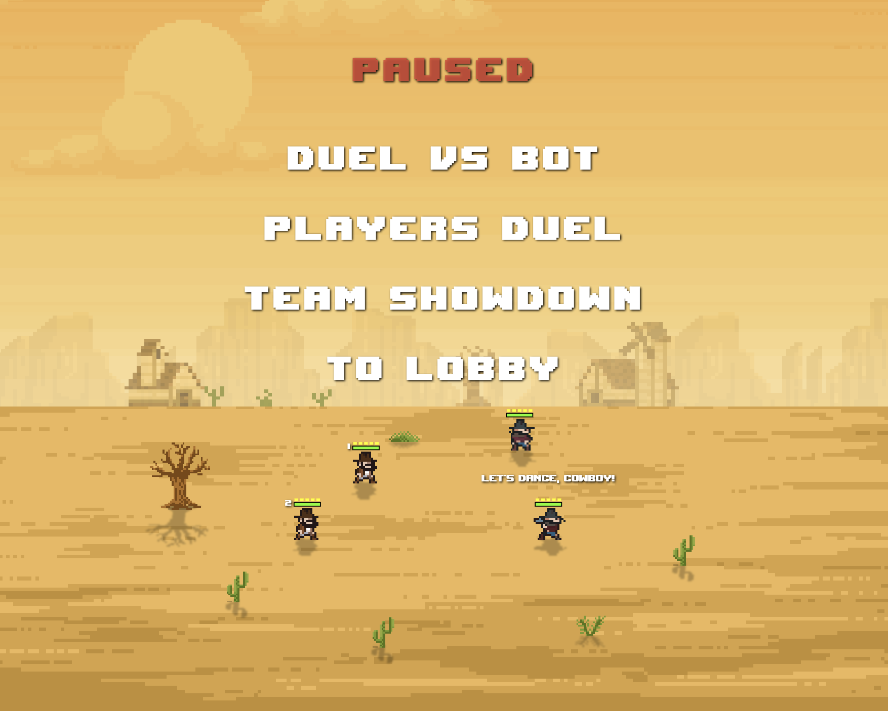

# 🤠 Simple Western

A **2D pixel-art western shooter** built with **Flutter & Flame**. Engage in thrilling duels, battle against AI bots,
and test your skills in fast-paced shootouts!

[🎮 Play the demo](https://western.clu.by/)



---

## 🕹 **Controls**

| Player         | Movement     | Shoot   | Reload  |
|---------------|-------------|---------|---------|
| **P1 (Left)**  | `WASD`       | `Q`     | `E`     |
| **P2 (Right)** | `Arrow Keys` | `Shift` | `Enter` |

💡 **Tip**: Watch your ammo! Running out in the middle of a duel can be deadly.

---

## 🛠 **Tech Stack**

- **Flutter** (game framework)
- **Flame** (game engine)
- **Dart** (programming language)
- **Pixel-art assets** (custom & Fiverr artists)

---

## 📥 **Installation & Setup**

### 🛠 Install Flutter & Dart

Ensure you have Flutter installed. If not, follow these steps:

1. **Download & Install Flutter**: [Flutter Installation Guide](https://docs.flutter.dev/get-started/install)
2. **Set up Dart** (comes with Flutter)
3. **Check installation**:

```sh
flutter doctor
```

### 📦 Install Dependencies

```sh
flutter pub get
```

### 🏃 Run the game

```sh
flutter run
```

### 🔧 Build for Web

```sh
flutter build web
```

